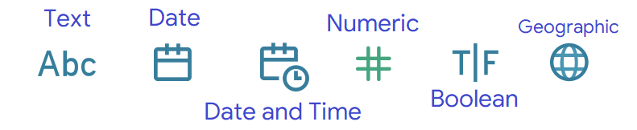

# Tableau

### `Terms`

`Row` | `Observation` 

`Column` | `Field`

### `Dimensions`  
- `Qualitative` values like `Names`, `Dates`, `Category` or `Geographical` Data.
-  `Dimensions` are used to `categorize`, `segment`, and `reveal` the details in your data.
-  `Dimensions` affect the `level` of detail in the view.

### `Measures`  
- `Quantitative` values. 
- `Measures` can be `aggregated`
- `Tableau` applies an `aggregation` to the measure by default.

`Discrete Dimension` or `Continuous Measure` are most common.

`Continuous Dimension` or `Discrete Measure` are less common.

### `Data types`

